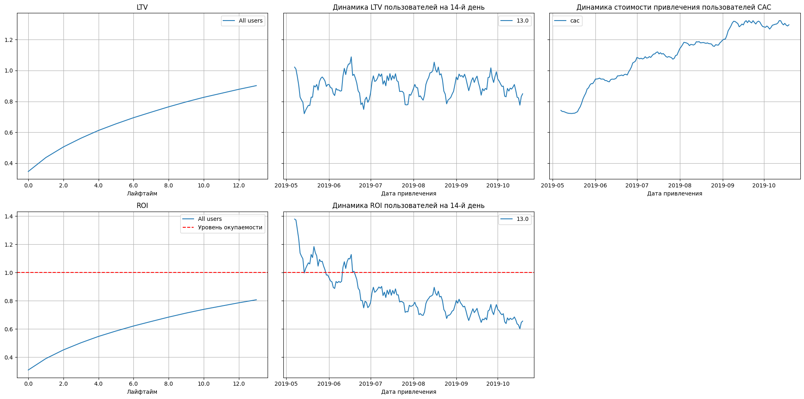
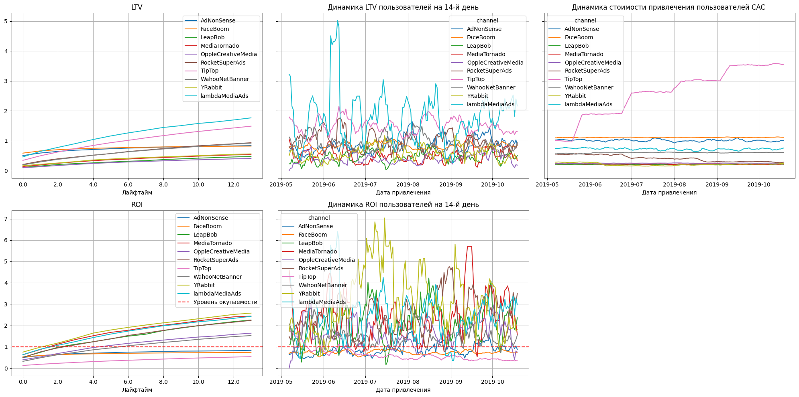
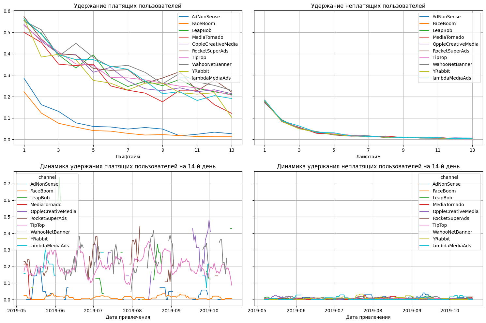

# Анализ маркетинговых метрик: LTV, CAC, ROI

## О проекте
Проект посвящён анализу эффективности привлечения пользователей и оценке окупаемости маркетинговых инвестиций.

На основе данных о визитах, покупках и рекламных расходах исследуются источники привлечения, стоимость привлечения пользователей, их ценность для бизнеса и факторы, влияющие на окупаемость рекламы.

Цель проекта — определить причины неэффективности маркетинговых вложений и подготовить рекомендации по более рациональному распределению рекламного бюджета.

## Бизнес-задача
Компания активно инвестирует в рекламу, но несмотря на значительные затраты, не выходит в прибыль.

В рамках проекта нужно было ответить на вопросы:
- окупается ли привлечение пользователей в целом;
- какие рекламные каналы работают неэффективно;
- как различаются каналы по стоимости привлечения и ценности пользователей;
- какие факторы снижают общую окупаемость рекламы.

## Задачи
- загрузить и подготовить данные о визитах, заказах и рекламных расходах;
- сформировать профили пользователей и определить ключевые параметры привлечения;
- рассчитать маркетинговые и продуктовые метрики: **LTV**, **CAC**, **ROI**, **Retention Rate**, **Conversion Rate**;
- провести когортный анализ;
- сравнить эффективность привлечения по рекламным каналам, странам и устройствам;
- проанализировать конверсию и удержание пользователей;
- выявить причины низкой окупаемости рекламы;
- сформулировать рекомендации для маркетингового отдела.

## Инструменты и технологии
- **Python** — основной язык анализа данных;
- **pandas** — загрузка, очистка, объединение таблиц и расчёт метрик;
- **NumPy** — численные вычисления;
- **matplotlib** — визуализация окупаемости, конверсии и удержания;
- **datetime** — работа с временными данными;
- **Jupyter Notebook** — среда для анализа и оформления выводов;
- **пользовательские функции**:
  - `get_profiles()` — создание профилей пользователей и расчёт CAC;
  - `get_retention()` — расчёт удержания;
  - `get_conversion()` — расчёт конверсии;
  - `get_ltv()` — расчёт LTV и ROI.

## Визуализация проекта

### Общая оценка юнит-экономики

### Юнит-экономика по рекламным каналам

### Удержание пользователей по рекламным каналам

## Структура репозитория
- `README.md` — описание проекта
- `marketing_metrics_analysis.ipynb` — ноутбук с расчётами, визуализациями и выводами
- `images/` — графики, используемые в README

## Как открыть проект
Проект представлен в виде Jupyter Notebook с кодом, расчётами, визуализациями и выводами.
